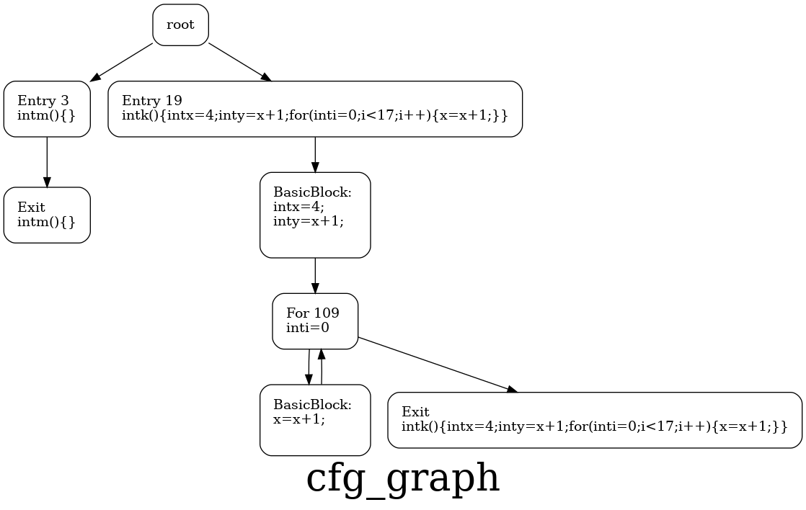
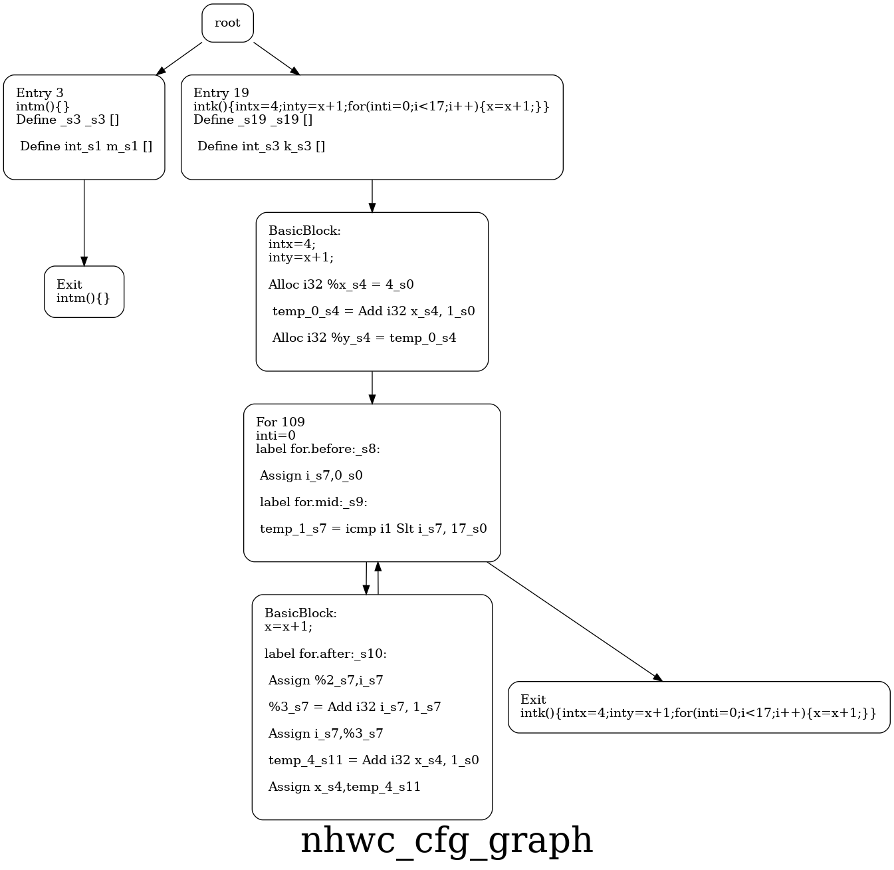
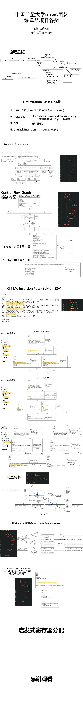

# nhwc compiler

nhwc compiler 的目标是成为一个简化版的类llvm的编译器框架，用于生成 nhwc ir、riscv assembly。
这个项目专注于代码可读性，因此使用了大量贴合英语语法的宏和 graphviz 的可视化功能生成图样来更好的debug

# The nhwc_compiler Project is under the Apache License v2.0

# nhwc 是什么意思？

nhwc 的意思是 Never Happy When Coding ，出自动画「BanG Dream! It's Mygo!!!」中台词:"我从来没有觉得玩乐队开心过。"

## 进度

- [x] 基础设施
    - [x] 符号表
        - [x] 支持快速查找符号(使用平衡树套哈希表)
        - [x] 支持对符号动态添加field信息
    - [x] 图
        - [x] 定义简洁的宏来完成访问和插入节点操作
    - [x] nhwc ir
        - [x] 支持 phi-node 
        - [x] 支持简单的的 llvm ir 功能
        - [ ] 支持 对数组访问和修改命令
    - [x] riscv instr
        - [x] 支持常见的32位操作
    - [x] Pass形式组织的框架
- [ ] 编译总流程
    - [x] code2ast_pass  由c语言代码构造ast树
        - [x] antlr 自带的图结构转 petgraph 图结构
    - [x] ast2st_pass 由 ast 树构造 scope tree 解析作用域
        - [x] 支持 ast node 与 st node 互相映射 
    - [ ] ast2et_debug_pass 这个 Pass 仅用于绘制 expression tree 图片，测试toolkit::gen_et
        - [x] 支持数组相关 Operator
        - [x] 支持对节点添加 def 或 use 信息
        - [x] 支持简单的常量子树计算优化
        - [x] 支持解析单个 statement 
        - [ ] 支持直接解析整一个basic block 
    - [x] ast2cfg_pass 用于将 ast 树转化为 cfg (不带nhwc ir)
    - [x] cfg2ncfg_pass 用于从 cfg(不带nhwc ir) 构造 ncfg(带nhwc ir 的cfg)
        - [x] 符号作用域检查
        - [x] 支持遍历作为 树的 et 
        - [ ] 支持遍历作为 DAG的 et 
    - [x] ncfg2ssa_ncfg 将 ncfg(non-ssa) 转化为 ssa形式的ncfg
        - [x] 插入 phi-node 
        - [x] 变量重命名
    - [x] nhwc_collect_pass 将图中的 nhwc ir 收集为一个文本文件
    - [x] simulator_debug_pass 用于执行ir，是一个ir解释器，
        - [x] 支持运行main 函数
        - [x] 支持插入断点并运行在.c 文件中以代码的形式添加
    - [ ] nhwc2riscv_pass 由nhwc ir 转化为 riscv
        - [ ] 完成nhwc ir 到riscv assembly 的简单对应
    - [ ] riscv2binary_pass 将riscv 汇编文件编译为二进制文件
- [ ] 高级优化
    - [ ] 支持循环展开
    - [ ] 支持对表达式进行公共子表达式消除
    - [ ] 支持向量化
    - [ ] 支持常量传播

更多内容，敬请期待


## Pass 形式组织的框架

```rust
fn main() {
    
    // 读取命令选项，诸如 -c 表示代码文件地址
    // 你也可以通过运行 cargo run -- --help 来查看所有可用选项
    let args = Args::parse();
    // args.c_file_path = PathBuf::from_str("./demos/demo1.c").unwrap();
    let mut pass_manager = PassManager::new(args);
    let code2ast_pass = Code2AstPass::new(true);
    let ast2cfg_pass = Ast2CfgPass::new(true);
    let ast2et_debug_pass = Ast2EtDebugPass::new(true);
    let cfg2ncfg_pass = Cfg2NcfgPass::new(true);
    let ast2st_pass = Ast2StPass::new(true);
    add_passes!(
        code2ast_pass
        then ast2et_debug_pass
        then ast2cfg_pass
        then ast2st_pass
        then cfg2ncfg_pass
        to pass_manager
    );
    timeit!({pass_manager.execute_passes()}, "all passed finish");
}
```

<!-- ## 使用C语言语法文件C.g4和antlr生成ast树 -->


生成ast树的具体pass代码参见 [code2ast_pass.rs](./src/passes/code2ast_pass.rs)，其他以此类推

```rust
impl Pass for Code2AstPass{
    // 运行这个pass 
    fn run(&mut self,ctx:&mut Context) {
        println!("pass Code2AstPass run");
        ctx.code = read_file_content(ctx.args.c_file_path.to_string_lossy().into_owned());
        parse_as_ast_tree(ctx);
        // 生成对应的png 
        if self.is_gen_png{
            let ast_tree = &mut ctx.ast_tree;
            generate_png_by_graph(&ast_tree,"ast_tree".to_string(),&[Config::EdgeNoLabel]);  
        }

    }
}
```

<!-- ## 2.通过调用一些宏来方便代码书写,如寻找某节点下的子节点(单个或所有子节点),给图增加节点和边等等

<p align="center"></p>

<p align="center"></p>

<p align="center"></p> -->

<!-- ## 1. 定义cfg node和cfg edge,把ast转化成cfg(control flow graph)控制流程图 -->

# ast 

<p align="center"></p>

# scope tree 

<p align="center"></p>

# et

<p align="center"></p>

# cfg 

<p align="center"></p>

# ncfg 

<p align="center"></p>

# def use chain graph

<p align="center"></p>

# simulator_graph

<p align="center"></p>

<!-- #  -->

<!-- ## 4.构建符号表,定义新的变量时将其加入,可用于判断符号在当前作用域是否合法,并记录该符号信息(值类型,内容等) -->

<!-- ## 6.定义变量类型,用于判断变量类型是否合法 -->


<!-- ## 7.定义了instruction,是nhwc的基本结构.并生成了nhwc的cfg

### instruction把所有语句分成了

>定义函数

>定义变量

>算数运算(+ - * /)

>简单赋值语句

>调用(Call)函数

>跳转(Jump)语句(break continue return)

>phi函数

共7种在cfg中出现的节点 -->

<!-- 
## 8.定义并生成et_tree(expression tree表达式树),以及组成部分--etnode,并自定义添加debug输出,方便观察expression语句,且考虑到一元运算符+=,+=,-=,/=,*=


## 9.添加def-use链

每次调用变量名时,若符号表中不存在,则第一次出现,判定为def,并加入符号表,若之后再次出现,则判定为use,并加入def-use链


## 10.添加了debug输出,方便观察


# 正在进行的部分

## 添加了多个pass,并可选地生成对应png

<p align="center"></p> -->

<!-- >1.code转化为ast -->
<!-- <p align="center"></p>

<p align="center"></p>

<p align="center"></p>

<p align="center"></p>

<p align="center"></p> -->

# 答辩ppt如下:
<p align="center"></p>