nhwc是一个类llvm的编译器框架，它包含一个代码生成框架,可以用来生成汇编代码、LLVM IR、Object code等。

# 已经完成的部分

## 1.我们借助C语言的语法文件C.g4和antlr生成ast树

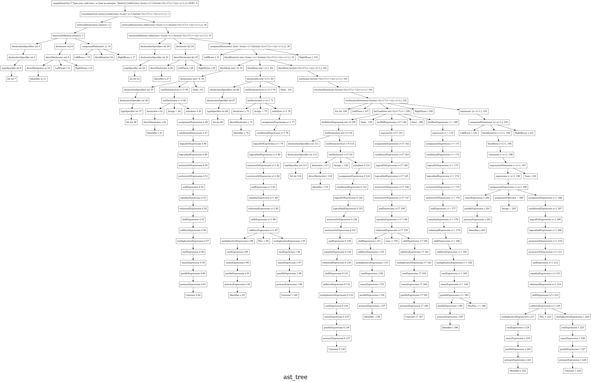  

---

## 2.通过调用一些宏来方便代码书写,如寻找某节点下的子节点(单个或所有子节点),给图增加节点和边等等

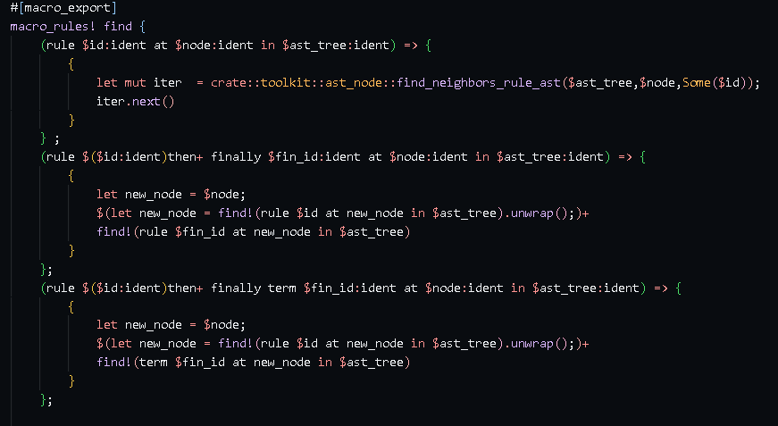

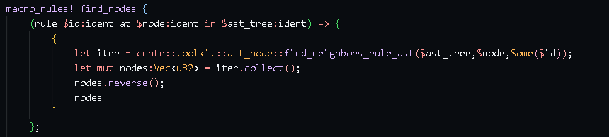

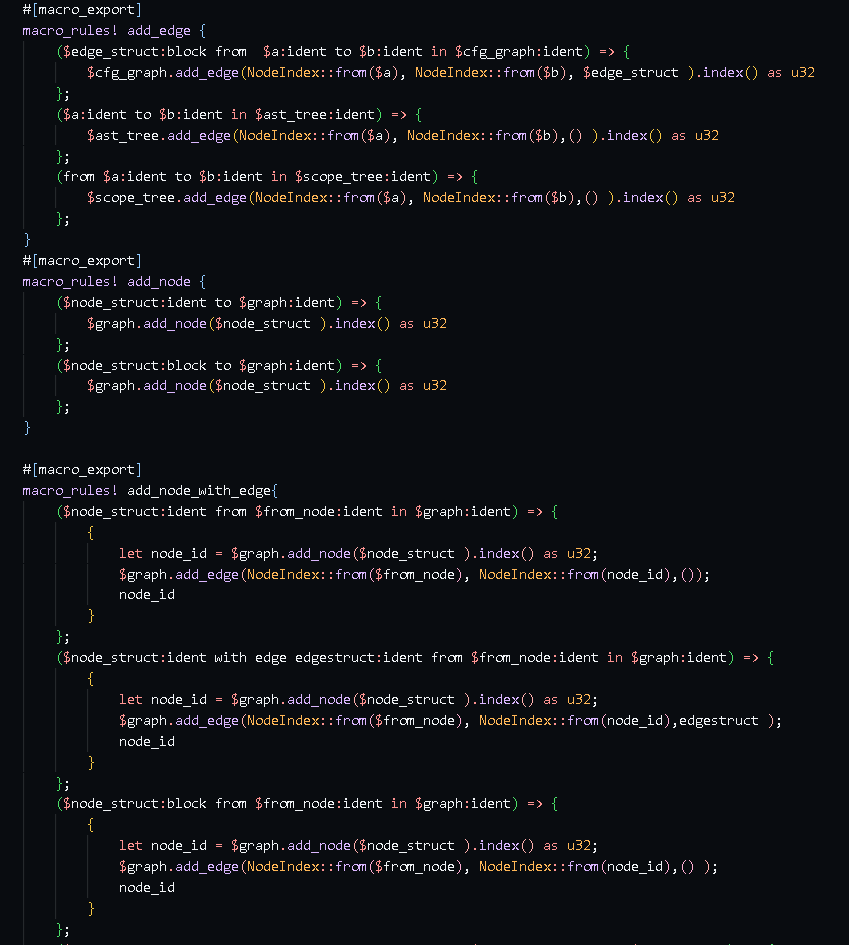

---

## 3.定义cfg node和cfg edge,把ast转化成cfg(control flow graph)控制流程图

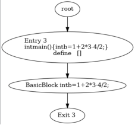

---

## 4.构建符号表,定义新的变量时将其加入,可用于判断符号在当前作用域是否合法,并记录该符号信息(值类型,内容等)

---

## 5.定义scop_tree作用域树,可以用来观察语句所在作用域

### 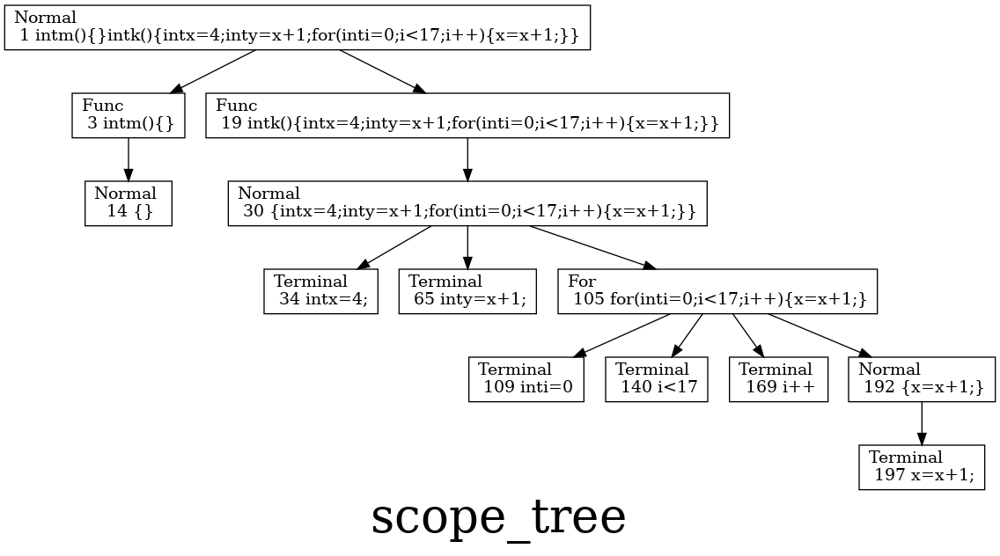

---

## 6.定义变量类型,用于判断变量类型是否合法

### Datatype 在哪里?

---

## 7.定义了instruction,是nhwc的基本结构.并生成了nhwc的cfg

### instruction把所有语句分成了

>定义函数

>定义变量

>算数运算(+ - * /)

>简单赋值语句

>调用(Call)函数

>跳转(Jump)语句(break continue return)

>phi函数

共7种在cfg中出现的节点

---

## 8.定义并生成et_tree(expression tree表达式树),以及组成部分--etnode,并自定义添加debug输出,方便观察expression语句,且考虑到一元运算符+=,+=,-=,/=,*=

### 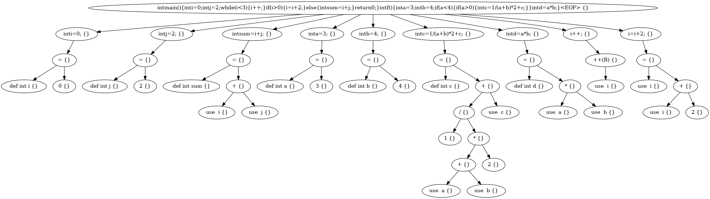

---

## 9.添加def-use链

每次调用变量名时,若符号表中不存在,则第一次出现,判定为def,并加入符号表,若之后再次出现,则判定为use,并加入def-use链

---

## 10.添加了debug输出,方便观察

---

# 正在进行的部分

## 添加了多个pass,并可选地生成对应png

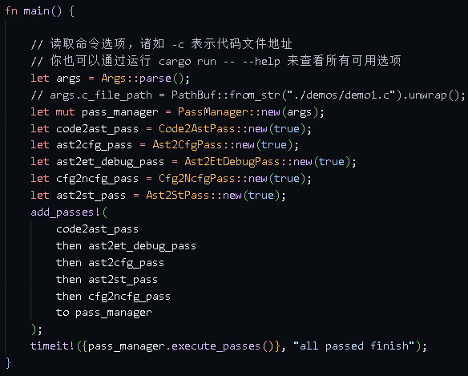

>1.code转化为ast
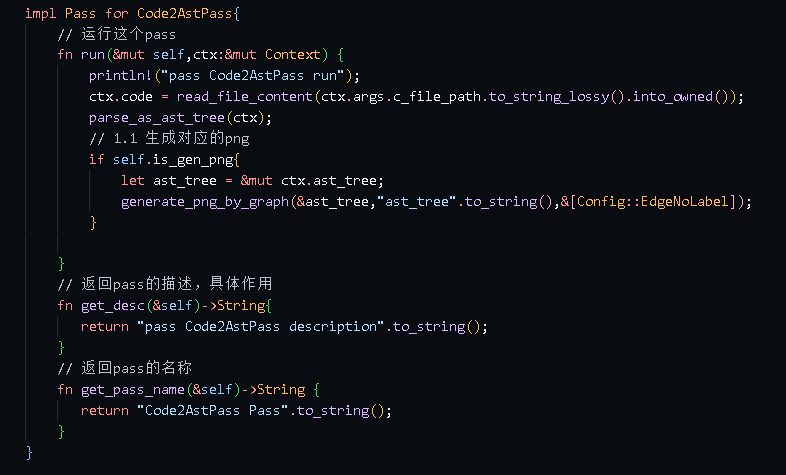
>2.ast转化为cfg
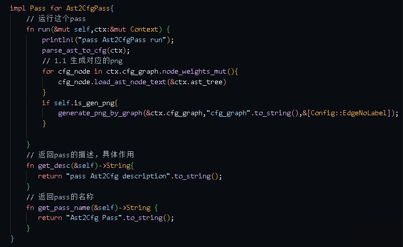
>3.ast转化为et_debug
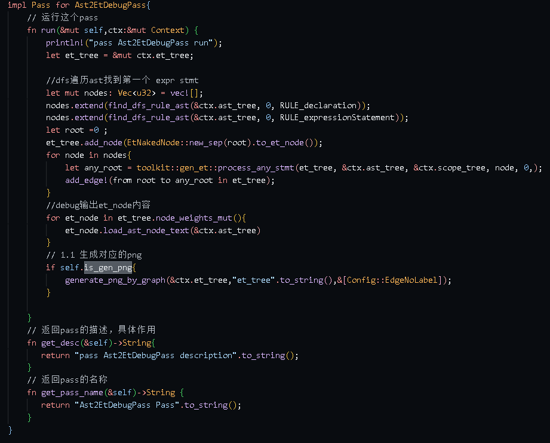
>4.cfg转化为nhwc_cfg
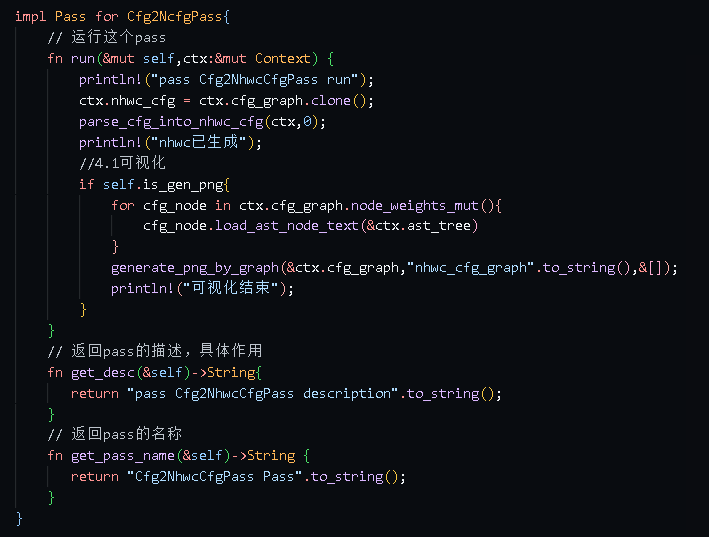
>5.ast转化为scope tree
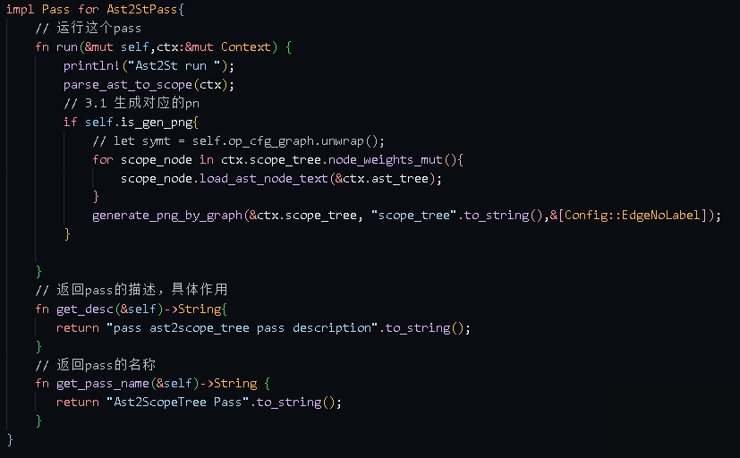
